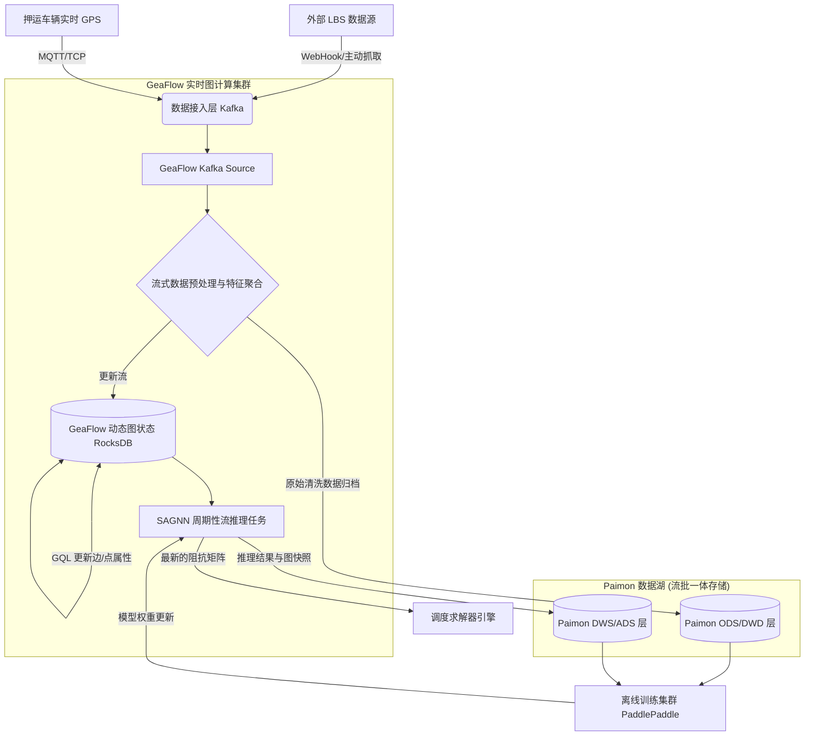

# GeaFlow 与 LBS 服务高实时对接及数据湖落地方案

## 1. 业务痛点与对接需求

在“厦门安保押运智能调度”系统中，路网阻抗（如五桥两隧的通行时间）呈现出极强的分钟级潮汐波动。传统的定时批量拉取 LBS（Location-Based Services，如百度地图智慧交通）数据的方式存在以下致命缺陷：
1. **数据微观滞后**：批量拉取周期通常为 15-30 分钟，无法应对突发交通事故导致的瞬时拥堵。
2. **读写锁冲突**：批量更新整个城市级别的路网图谱极易对调度算法的在线查询造成阻塞。
3. **历史数据利用率低**：单纯的实时流处理丢弃了宝贵的历史特征数据，而这些数据是离线训练（如 SAGNN 潮汐预测模型更新、RLHF 调度员偏好学习）不可或缺的基石。

**核心目标**：构建“流批一体”的混合架构，利用 GeaFlow 的**流式图计算**能力实现毫无延迟的图状态更新与在线推理，同时通过对接 **Apache Paimon** 等数据湖技术，将流式数据与图快照实时落盘，为离线模型训练与历史回溯提供底层支撑。

## 2. 流湖一体的整体架构设计

系统采用 **“流式特征接入 -> 动态图谱更新 -> 实时/周期性推理 -> 数据湖归档与离线训练”** 的 Kappa/Lambda 混合架构。



## 3. 核心技术路径与落地设计

### 3.1 实时数据接入层 (Kafka Connector)
引入轻量级微服务高频并发请求 LBS API，或接收来自车辆的 GPS 报文流。将异构数据清洗为统一的 JSON 格式后，打入 Kafka Topic。GeaFlow 通过 GQL 声明为 Kafka 流表。

### 3.2 流式图谱动态更新 (Streaming Graph Mutation)
利用 GeaFlow 最强大的**动态图（Dynamic Graph）**能力，将 Kafka 摄入的数据流实时更新至底层 RocksDB 状态引擎中。路网图不是静态的，而是随着时间不断演进的状态机。这一层保证了在线调度推断时使用的是毫秒级延迟的最新路况。

### 3.3 数据湖落盘与流批融合 (Paimon Integration)
GeaFlow 作为一个图计算与流计算引擎，其内部状态（RocksDB）核心作用是支撑在线图遍历与推理，不适合作为海量历史数据的永久存储和离线大规模扫表扫描。引入 Apache Paimon 数据湖：
- **原始流归档 (ODS)**：GeaFlow 消费 Kafka 数据并完成初步清洗后，通过 Paimon Sink 直接写入数据湖，支持分钟级乃至秒级的增量数据可见性。
- **图状态快照落盘 (DWS)**：利用 GeaFlow 的批处理能力或定时任务，将图引擎中的完整属性图（包括节点和边的历史阻抗序列和预测结果）定期 Dump 到 Paimon 中。
- **列式存储优化**：Paimon 底层采用 ORC/Parquet 格式，具备极佳的压缩比，并且极大地优化了后续 PaddlePaddle 读取历史轨迹进行 SAGNN 模型增量训练时的 I/O 效率。

## 4. 生产级 GQL 代码落地示例

以下为结合流式图更新与 Paimon 落盘的具体 GQL 架构实现：

```sql
-- 1. 定义 Kafka 实时 LBS 流表
CREATE TABLE lbs_traffic_stream (
    road_id VARCHAR,
    speed DOUBLE,
    congestion_level INT,
    event_time BIGINT
) WITH (
    type='kafka',
    geaflow.dsl.kafka.servers = 'kafka-cluster:9092',
    geaflow.dsl.kafka.topic = 'xiamen_traffic_topic',
    geaflow.dsl.window.type = 'ts',  -- 按照事件时间驱动
    geaflow.dsl.window.size = '10'   -- 10秒微批驱动
);

-- 2. 定义 Paimon 数据湖 Sink 表 (用于持久化历史数据)
CREATE TABLE paimon_traffic_sink (
    road_id VARCHAR,
    speed DOUBLE,
    congestion_level INT,
    event_time BIGINT,
    dt VARCHAR -- 按照日期分区
) WITH (
    type='paimon',
    catalog_type='hive',
    catalog_uri='thrift://hive-metastore:9083',
    warehouse='hdfs://namenode:8020/user/paimon/warehouse',
    database_name='xiamen_logistics',
    table_name='traffic_history'
);

-- 3. 将 Kafka 实时流双写：一路落盘 Paimon，一路准备更新图状态
INSERT INTO paimon_traffic_sink
SELECT 
    road_id, 
    speed, 
    congestion_level, 
    event_time, 
    -- 毫秒时间戳转 yyyyMMdd 格式作为分区字段
    FROM_UNIXTIME(event_time/1000, 'yyyyMMdd') as dt 
FROM lbs_traffic_stream;

-- 4. 定义静态底图体系 (厦门路网)
CREATE GRAPH xiamen_road_network (
    Vertex intersection (
        id VARCHAR ID, lat DOUBLE, lng DOUBLE
    ),
    Edge road_segment (
        srcId VARCHAR SOURCE ID, targetId VARCHAR DESTINATION ID,
        distance DOUBLE, current_speed DOUBLE, congestion_index DOUBLE, update_time BIGINT
    )
) WITH (
    storeType='rocksdb',  -- 使用 RocksDB 作为底层状态存储
    shardCount = 16
);

-- 5. 流式更新图状态 (就地覆盖)
INSERT INTO xiamen_road_network.road_segment
SELECT 
    r.src_id, r.target_id, r.distance, 
    s.speed as current_speed, s.congestion_level as congestion_index, s.event_time as update_time
FROM lbs_traffic_stream s
JOIN xiamen_road_mapping r ON s.road_id = r.road_id; 

-- 6. 触发 SAGNN 推理并将预测结果落盘至 Paimon
CREATE TABLE predicted_impedance_paimon_sink (
    node_id VARCHAR,
    future_impedance DOUBLE
) WITH ( 
    type='paimon',
    database_name='xiamen_logistics',
    table_name='predicted_impedance'
    -- ...同上其他 Paimon 配置
);

INSERT INTO predicted_impedance_paimon_sink
CALL sagnn(
    (SELECT * FROM xiamen_road_network), -- 读取图谱的最新快照进行推理
    'num_heads' = '4',
    'dropout' = '0.0'
) YIELD (node_id, predicted_congestion_feature);
```

## 5. 数据实效性与一致性保障机制

### 5.1 读写分离、流批隔离
在线调度业务（VRP 调度算法计算）通过请求 GeaFlow 从 RocksDB 状态后端中读取毫秒级更新的图快照，保证高度敏捷；而离线业务（模型增量训练、BI 报表）则直接从 Paimon 中读取具有强一致性的版本快照（Snapshot），不会对实时计算集群的内存与 CPU 造成任何争抢。

### 5.2 Paimon 数据湖的关键特性赋能
相比于直接写 HDFS 文本或传统 Hive 表，Paimon 为系统提供了额外的技术红利：
- **实时 Upsert（Primary Key Table）**：支持高频的 Upsert 和 Delete 操作。这使得 Paimon 不仅能存储追加日志（Append-only），还能实时维持各个网点和路段属性的最终一致性视图。
- **流读能力（Streaming Read）**：当后续调度员的反馈数据（RLHF）存入 Paimon 后，可以启动一个流式任务增量读取变更的偏好数据，直接“喂”给 PaddlePaddle 的奖赏模型（Reward Model）进行在线微调，缩短了专家经验的闭环学习链路。
- **Time Travel（时间旅行）**：允许在训练 SAGNN 时读取 Paimon 过去某一时点（如“上周二早高峰8:00”）的全量路况快照。这一特性对于重现案发现场、验证调度算法改进效果具备决定性作用。

## 6. 演进落地建议

1. **初期 (流图双写与日志沉淀)**：搭建 `Kafka -> GeaFlow -> (RocksDB 更新 + Paimon 归档)` 的基础流处理链路。重点验证流式图更新的延迟指标与 Paimon 增量落盘的稳定性，积累一个月的高质量时空训练语料。
2. **中期 (流批一体闭环训练)**：将 SAGNN 模型提取历史特征的逻辑数据源全面切换至 Paimon。利用 Paimon 的 Time Travel 和列存优势，构建针对“五桥两隧”高潮汐路段的时间序列切片，实现模型的每日离线更新，权重回推至 GeaFlow Infer 层。
3. **终态 (全域智能数据资产化)**：将 VRP 调度引擎每次生成的全域排班计划（Plan）、车辆终端返回的实际执行轨迹（Actual）、以及调度员在看板上人工干预的动作记录（Intervention）全部打入 Paimon 数据湖。以此形成统一的数字孪生底座，为长期优化 RLHF 人机对齐算法提供源源不断的燃料。